# Canadian Retail Credit Risk Analytics

## Explainable Default Prediction, Portfolio Monitoring & Model Governance

This project develops an end-to-end credit risk analytics workflow for a Canadian retail lending portfolio. It combines data quality review, borrower-risk segmentation, machine-learning default prediction, business threshold selection, explainable AI, and model-governance documentation.

The project is designed as a finance-industry portfolio project for roles such as Credit Risk Analyst, Risk Analytics Analyst, Data Analyst - Credit Risk, Model Risk Analyst, Portfolio Analytics Analyst, and Banking Data Scientist.

---

## Business problem

Retail lenders need to identify borrowers with elevated default risk before losses materialize. A useful credit-risk model should not only rank risky borrowers, but also support portfolio monitoring, operational review capacity, explainability, and governance.

This project frames the model as an **early-warning default-risk ranking and manual-review prioritization tool**. It is not positioned as an automated credit-decline or pricing engine.

Core business questions:

- Which borrower segments show elevated observed default risk?
- Which data quality issues affect portfolio monitoring and model reliability?
- Can a machine-learning model rank borrowers by default risk better than simple baselines?
- What operating threshold balances default capture against manual-review workload?
- Which features drive model decisions globally and for individual borrowers?
- What governance controls are needed before such a model could be used in a financial institution?

---

## Project highlights

| Area | Result |
|---|---:|
| Portfolio records | 134,417 |
| Observed default rate | 9.04% |
| Total portfolio exposure | ~$14.70B |
| Defaulted exposure share | 5.96% |
| Champion model | XGBoost weighted classifier |
| Test ROC-AUC | 0.7468 |
| Test PR-AUC | 0.2168 |
| Selected operating threshold | 0.565 |
| Test recall at operating threshold | 61.49% |
| Test precision at operating threshold | 19.10% |
| Test review rate at operating threshold | 29.11% |
| Primary governance decision | Use for decision support and manual-review prioritization only |

The selected operating threshold reduces review volume compared with the default 0.50 cutoff while still capturing a meaningful share of default cases. All business-cost values in this project are illustrative and used for threshold comparison, not financial forecasting.

---

## Key insights

### 1. Default risk is segment-dependent

Portfolio monitoring identified elevated default rates in specific borrower groups, including business loans, self-employed borrowers, and records with missing loan amount information. This supports the need for risk segmentation before model deployment.

### 2. Missingness is both a data-quality issue and a risk signal

The missing loan amount flag had meaningful explanatory power. The project keeps missingness indicators rather than dropping incomplete rows, because missingness may reflect operational or underwriting risk patterns.

### 3. Leakage control materially improves credibility

Repayment-derived variables were excluded from the modelling feature set because they can leak target information. Sensitive and proxy-sensitive fields were retained for audit review but excluded from the baseline model.

### 4. Threshold selection is a business decision

The model was not evaluated only at the default 0.50 threshold. A validation-based operating threshold of 0.565 was selected under a manual-review cap, aligning model output with operational capacity.

### 5. Explainability supports stakeholder trust

SHAP analysis identified the strongest model drivers, including interest rate, loan amount missingness, data-quality issue counts, income, loan-to-income band, high-interest flags, tenure, loan category, and home ownership. Local explanations, anchor-like rules, and counterfactual scenarios were generated for business interpretation.

---

## Methodology

```mermaid
flowchart LR
    A[Raw Excel sheets] --> B[Data ingestion and grain validation]
    B --> C[Data quality assessment]
    C --> D[Cleaning and preprocessing]
    D --> E[Portfolio monitoring and EDA]
    E --> F[Feature engineering and leakage review]
    F --> G[Model training and validation]
    G --> H[Threshold selection and business costing]
    H --> I[Explainable AI]
    I --> J[Model governance and monitoring plan]
```



---

## Repository structure

```text
canadian-retail-credit-risk-xai/
|
|-- README.md
|-- requirements.txt
|-- pyproject.toml
|-- config/
|   |-- config.yaml
|   |-- model_config.yaml
|
|-- data/
|   |-- raw/          # local only; not committed
|   |-- interim/      # generated; not committed
|   |-- processed/    # generated; not committed
|   |-- external/
|   |-- sample/
|
|-- notebooks/
|   |-- 00_project_brief_and_business_context.ipynb
|   |-- 01_data_ingestion_and_schema_review.ipynb
|   |-- 02_data_quality_assessment.ipynb
|   |-- 03_data_cleaning_and_preprocessing.ipynb
|   |-- 04_credit_risk_eda_and_portfolio_monitoring.ipynb
|   |-- 05_feature_engineering_and_leakage_review.ipynb
|   |-- 06_model_training_and_evaluation.ipynb
|   |-- 07_threshold_selection_and_business_costing.ipynb
|   |-- 08_explainable_ai_shap_anchors_counterfactuals.ipynb
|   |-- 09_model_governance_and_monitoring.ipynb
|
|-- src/credit_risk/
|   |-- data/
|   |-- features/
|   |-- models/
|   |-- explainability/
|   |-- monitoring/
|   |-- governance/
|   |-- utils/
|
|-- reports/
|   |-- figures/
|   |-- tables/
|   |-- governance/
|   |-- model_artifacts/   # local only; not committed
|
|-- scripts/
|-- tests/
|-- docs/
```

---

## Notebook workflow

| Notebook | Purpose |
|---|---|
| 00 | Business context, problem framing, and project scope |
| 01 | Excel ingestion, sheet review, record-grain validation, and merge logic |
| 02 | Data quality assessment, missingness, duplicate review, and leakage flags |
| 03 | Cleaning, category standardization, missing flags, and audit tables |
| 04 | Portfolio monitoring, segment risk, exposure review, and EDA |
| 05 | Feature engineering, train/validation/test split, and leakage review |
| 06 | Model training and evaluation across logistic regression, random forest, and XGBoost |
| 07 | Threshold selection, review-rate constraints, and illustrative business-cost analysis |
| 08 | SHAP explainability, local explanations, anchor-like rules, and counterfactuals |
| 09 | Model card, validation summary, control register, risk limits, and monitoring plan |

---

## Models evaluated

The project evaluates three candidate models:

- Logistic Regression with class balancing
- Random Forest with class balancing
- XGBoost with class weighting

Model selection prioritizes metrics that matter for imbalanced credit risk problems:

- PR-AUC
- ROC-AUC
- Recall
- Precision
- F1 score
- Balanced accuracy
- Matthews correlation coefficient
- Review rate
- Illustrative business cost

Accuracy is not used as the primary selection metric because the default class is imbalanced.

---

## Champion model performance

### Default 0.50 threshold

| Dataset | ROC-AUC | PR-AUC | Recall | Precision | Review rate |
|---|---:|---:|---:|---:|---:|
| Validation | 0.7511 | 0.2294 | 72.08% | 17.14% | 38.02% |
| Test | 0.7468 | 0.2168 | 72.74% | 17.29% | 38.04% |

### Selected operating threshold: 0.565

| Dataset | Recall | Precision | Review rate | Business interpretation |
|---|---:|---:|---:|---|
| Validation | 61.93% | 18.96% | 29.53% | Selected using validation data and review-cap constraint |
| Test | 61.49% | 19.10% | 29.11% | Stable held-out performance |

---

## Explainable AI outputs

The project generates business-readable XAI artifacts:

- Global SHAP feature importance
- SHAP dependence-style plots
- Local borrower-level explanations
- Anchor-like high-risk rules
- Counterfactual sensitivity scenarios
- Best counterfactual scenario per reviewed account

Important governance note: counterfactuals are treated as **diagnostic model-sensitivity scenarios**, not customer advice or adverse-action explanations.

---

## Example visual outputs

### Portfolio default distribution


### Default rate by loan category


### Global SHAP drivers


---

## Governance outputs

The final governance notebook creates:

- `reports/governance/model_card.md`
- `reports/governance/model_validation_summary.md`
- `reports/governance/stakeholder_brief.md`
- `reports/governance/model_monitoring_plan.md`
- `reports/tables/model_control_register.csv`
- `reports/tables/model_risk_limit_register.csv`
- `reports/tables/model_monitoring_kpi_snapshot.csv`

Key controls documented:

- Record-grain validation to prevent many-to-many merge inflation
- Data-quality flags and audit tables
- Exclusion of repayment-derived leakage features
- Exclusion of sensitive/proxy-sensitive variables from the baseline model
- Validation-based threshold selection
- Held-out test evaluation
- Explainability review
- Monitoring limits for drift, review rate, recall, precision, and data quality

---

## How to run locally

### 1. Create and activate environment

```bash
python -m venv .venv
```

Windows PowerShell:

```powershell
.venv\Scripts\Activate.ps1
```

macOS/Linux:

```bash
source .venv/bin/activate
```

### 2. Install dependencies

```bash
pip install -r requirements.txt
```

### 3. Add the raw workbook locally

Place the Excel workbook at:

```text
data/raw/Credit_Risk_Dataset.xlsx
```

Raw data is intentionally excluded from GitHub.

### 4. Run the full pipeline

```bash
python scripts/run_data_pipeline.py
python scripts/run_cleaning_pipeline.py
python scripts/run_portfolio_monitoring_pipeline.py
python scripts/run_feature_engineering_pipeline.py
python scripts/run_model_training_pipeline.py
python scripts/run_threshold_selection_pipeline.py
python scripts/run_explainability_pipeline.py
python scripts/run_governance_pipeline.py
```

### 5. Run notebooks in order

Open the notebooks in numerical order from `00` to `09`. The notebooks are designed to explain both the technical implementation and the business reasoning.

---

## Limitations

- The dataset is used for portfolio demonstration and does not represent a production Canadian bank system.
- The model is intended for risk ranking and review prioritization, not automated credit decisions.
- Business-cost assumptions are illustrative.
- Counterfactual scenarios are diagnostic only.
- Further productionization would require fairness testing, policy review, monitoring automation, independent validation, and legal/compliance approval.

---

## Portfolio positioning

This project demonstrates the ability to connect credit-risk business problems with analytical execution, machine learning, explainability, and governance documentation. It is intentionally structured to reflect the type of work performed in Canadian banking analytics, risk management, model governance, and portfolio monitoring teams.
