# Canadian Retail Credit Risk Analytics

## Explainable Default Prediction, Portfolio Monitoring, Threshold Strategy, and Model Governance


---

## Executive Summary

This project is an end-to-end **credit risk analytics and machine learning portfolio project** built around a Canadian retail lending use case. It combines data ingestion, data quality assessment, portfolio monitoring, feature engineering, machine learning, threshold selection, explainable AI, and model governance.

The project is positioned as an **early-warning default-risk ranking and manual-review prioritization solution**, not as an automated credit-decline engine. This framing is important for financial institutions because predictive models in credit risk must be explainable, auditable, operationally feasible, and aligned with model risk governance expectations.

The workflow reflects the type of work performed by teams in:

- Credit Risk Analytics
- Retail Risk Strategy
- Portfolio Monitoring
- Model Development
- Model Validation
- Risk Reporting
- Banking Data Science
- Model Governance

---

## Why This Project Matters

Retail lenders need to identify borrowers with elevated default risk before losses materialize. A useful credit risk model should do more than produce a probability score. It should answer business questions such as:

- Which borrower segments show higher observed default risk?
- Which data quality issues affect portfolio monitoring and model reliability?
- Which features are safe for modelling, and which may create leakage or fairness concerns?
- Which model ranks borrower risk most effectively under class imbalance?
- What threshold balances default capture with manual-review capacity?
- Why does the model flag a borrower as high risk?
- What governance controls are required before a model like this could be used in a financial institution?

This project demonstrates how to connect **business risk**, **data analysis**, **machine learning**, **explainability**, and **governance documentation** in one portfolio-ready workflow.

---

## Portfolio Positioning for Canadian Finance Roles

This project is designed to support applications for roles such as:

| Target role | How this project demonstrates fit |
|---|---|
| Credit Risk Analyst | Portfolio segmentation, default-rate analysis, exposure review, borrower-risk drivers |
| Risk Analytics Analyst | Python modelling, threshold analysis, performance monitoring, risk reporting |
| Data Analyst - Banking / Finance | Data quality checks, EDA, feature catalogues, reporting outputs, governance tables |
| Portfolio Analytics Analyst | Review-rate analysis, default-risk ranking, segment monitoring, KPI snapshots |
| Model Risk Analyst | Leakage review, validation/test comparison, model card, control register, monitoring plan |
| Banking Data Scientist | XGBoost, Random Forest, SHAP, counterfactuals, experiment tracking, model governance |
| BI / Reporting Analyst | Structured tables, stakeholder summaries, monitoring KPIs, reproducible reporting pipeline |

---

## Project Highlights

| Area | Result |
|---|---:|
| Portfolio records | 134,417 |
| Observed default rate | 9.04% |
| Total portfolio exposure | ~$14.70B |
| Defaulted exposure share | 5.96% |
| Champion operating model | XGBoost weighted baseline |
| Validation ROC-AUC | 0.7512 |
| Validation PR-AUC | 0.2263 |
| Test ROC-AUC | 0.7478 |
| Test PR-AUC | 0.2147 |
| Selected operating threshold | 0.560 |
| Test recall at operating threshold | 62.21% |
| Test precision at operating threshold | 19.09% |
| Test review rate at operating threshold | 29.46% |
| Primary governance decision | Use for decision support and manual-review prioritization only |

The model is evaluated using metrics appropriate for imbalanced credit risk classification. Accuracy is not used as the primary selection metric because the default class is much smaller than the non-default class.

---

## Business Impact

The selected operating threshold captures approximately **62% of default cases** on the held-out test set while keeping the manual-review population under the project’s **30% review-rate cap**. This converts model output into an operationally usable risk-ranking process.

The project separates three decisions that are often incorrectly mixed together:

1. **Model selection**: Which model ranks default risk best?
2. **Threshold selection**: What probability cutoff fits business capacity and risk appetite?
3. **Governance approval**: Is the model explainable, controlled, and ready for monitoring?

This separation makes the project more credible for finance-industry roles than a simple “train a model and report accuracy” workflow.

---

## Key Insights

### 1. Default risk is segment-dependent

Portfolio monitoring identified elevated default rates across specific borrower and loan segments. This supports the use of portfolio segmentation, risk ranking, and targeted manual review.

### 2. Missingness is both a data-quality issue and a model signal

Missing loan amount and other data-quality flags showed predictive value. The project keeps missingness indicators rather than dropping incomplete rows, while documenting governance limitations around interpreting missingness as borrower behaviour.

### 3. Leakage control is critical

Repayment-derived variables were excluded from the modelling feature set because they can leak information about the target. This is documented through a feature leakage and usage policy.

### 4. Threshold selection is a business decision

The final threshold was selected on validation data using review-cap and cost assumptions, then confirmed once on the test set. This reflects how risk models are operationalized in practice.

### 5. Explainability supports responsible model use

SHAP analysis, local explanations, anchor-style rules, and counterfactual scenarios were produced to support business interpretation. Counterfactuals are treated as diagnostic model-sensitivity scenarios, not as customer advice or adverse-action explanations.

### 6. Governance is part of the model deliverable

The project includes a model card, validation summary, stakeholder brief, control register, risk-limit register, and monitoring plan. This makes the project suitable for risk analytics, model validation, and governance-focused roles.

---

## Methodology

```mermaid
flowchart LR
    A[Raw Excel Workbook] --> B[Data Ingestion and Record-Grain Validation]
    B --> C[Data Quality Assessment]
    C --> D[Cleaning and Preprocessing]
    D --> E[Portfolio Monitoring and EDA]
    E --> F[Feature Engineering and Leakage Review]
    F --> G[Model Training and Validation]
    G --> H[Threshold Selection and Business Costing]
    H --> I[Explainable AI]
    I --> J[Model Governance and Monitoring]
```



---

## Repository Structure

```text
canadian-retail-credit-risk-xai/
|
|-- README.md
|-- requirements.txt
|-- pyproject.toml
|-- .gitignore
|
|-- config/
|   |-- config.yaml
|   |-- model_config.yaml
|
|-- data/
|   |-- raw/             # local only; not committed
|   |-- interim/         # generated; not committed
|   |-- processed/       # generated; not committed
|   |-- external/
|   |-- sample/
|
|-- notebooks/
|   |-- 00_project_brief_and_business_context.ipynb
|   |-- 01_data_ingestion_and_schema_review.ipynb
|   |-- 02_data_quality_assessment.ipynb
|   |-- 03_data_cleaning_and_preprocessing.ipynb
|   |-- 04_credit_risk_eda_and_portfolio_monitoring.ipynb
|   |-- 05_feature_engineering_and_leakage_review.ipynb
|   |-- 06_model_training_and_evaluation.ipynb
|   |-- 07_threshold_selection_and_business_costing.ipynb
|   |-- 08_explainable_ai_shap_anchors_counterfactuals.ipynb
|   |-- 09_model_governance_and_monitoring.ipynb
|
|-- src/credit_risk/
|   |-- data/
|   |-- features/
|   |-- models/
|   |-- explainability/
|   |-- monitoring/
|   |-- governance/
|   |-- utils/
|
|-- reports/
|   |-- figures/
|   |-- tables/
|   |-- governance/
|   |-- html/
|   |-- model_artifacts/  # local only; not committed
|
|-- scripts/
|-- tests/
|-- docs/
```

---

## Notebook Workflow

| Notebook | Purpose |
|---|---|
| 00 | Business context, project scope, stakeholder framing, and responsible-use boundaries |
| 01 | Excel ingestion, sheet review, record-grain validation, and merge logic |
| 02 | Data quality assessment, missingness, duplicate review, logical checks, and leakage flags |
| 03 | Cleaning, standardization, missingness flags, outlier review, and audit tables |
| 04 | Portfolio monitoring, exposure analysis, segment risk, statistical EDA, and reporting tables |
| 05 | Feature engineering, leakage-safe feature policy, train/validation/test split, and preprocessing design |
| 06 | Model training and validation across Logistic Regression, Random Forest, and XGBoost |
| 07 | Threshold selection, review-rate constraints, cost assumptions, and test confirmation |
| 08 | SHAP explainability, local explanations, anchor-style rules, counterfactuals, and Deepchecks diagnostics |
| 09 | Model card, validation summary, stakeholder brief, control register, risk limits, and monitoring plan |

---

## Models Evaluated

The project evaluates multiple modelling approaches:

- Logistic Regression baseline
- Random Forest weighted baseline
- Random Forest tuned challenger
- XGBoost weighted baseline
- XGBoost tuned challenger
- Optional train-only resampling challengers

Model comparison uses metrics that matter for imbalanced credit risk problems:

- ROC-AUC
- PR-AUC
- Recall
- Precision
- F1 score
- Balanced accuracy
- Matthews correlation coefficient
- Brier score
- Review rate
- Illustrative business cost

---

## Champion Model and Threshold Results

### Default 0.50 Threshold

| Dataset | ROC-AUC | PR-AUC | Recall | Precision | Review rate |
|---|---:|---:|---:|---:|---:|
| Validation | 0.7512 | 0.2263 | 71.59% | 17.09% | 37.76% |
| Test | 0.7478 | 0.2147 | 71.56% | 17.18% | 37.69% |

### Selected Operating Threshold: 0.560

| Dataset | Recall | Precision | Review rate | Business cost | Business interpretation |
|---|---:|---:|---:|---:|---|
| Validation | 62.59% | 19.05% | 29.71% | $5.83M | Selected using validation data under review-cap constraint |
| Test | 62.21% | 19.09% | 29.46% | $5.85M | Held-out confirmation of selected operating policy |

Business-cost values are illustrative scenario assumptions for threshold comparison. They are not accounting estimates or production loss forecasts.

---

## Explainable AI Outputs

Notebook 08 generates business-readable explainability artifacts:

- Global SHAP feature importance
- Grouped SHAP feature drivers
- SHAP dependence-style plots
- Borrower-level local explanations
- Anchor-style high-risk rules
- Counterfactual sensitivity scenarios
- Best counterfactual per reviewed account
- Deepchecks model evaluation report
- Stakeholder metric interpretation table

Important governance note: counterfactuals are diagnostic model-sensitivity scenarios and should not be used as direct customer instructions.

---

## Governance Outputs

Notebook 09 produces governance-ready documentation:

| Output | Purpose |
|---|---|
| `reports/governance/model_card.md` | Model overview, intended use, performance, explainability, and limitations |
| `reports/governance/model_validation_summary.md` | Validation/test evidence and governance decision |
| `reports/governance/stakeholder_brief.md` | Non-technical explanation for business stakeholders |
| `reports/governance/model_monitoring_plan.md` | Monitoring cadence, KPIs, risk limits, and escalation actions |
| `reports/tables/model_control_register.csv` | Model-risk controls and ownership |
| `reports/tables/model_risk_limit_register.csv` | Monitoring thresholds and breach actions |
| `reports/tables/model_monitoring_kpi_snapshot.csv` | Initial monitoring baseline |
| `reports/tables/model_governance_summary.csv` | Executive governance summary |

---

## Controls and Responsible-Use Decisions

The project documents controls that are important in financial-services analytics:

| Control area | Decision |
|---|---|
| Record grain | Preserve borrower record sequencing to prevent many-to-many merge inflation |
| Data quality | Retain missingness flags and data-quality indicators with governance notes |
| Leakage prevention | Exclude repayment-derived fields from model features |
| Sensitive/proxy fields | Exclude sensitive and proxy-sensitive fields from the baseline model |
| Model selection | Select models using validation data, not the test set |
| Threshold selection | Select operating threshold using validation data and capacity constraints |
| Test usage | Use test data only once for final confirmation |
| Explainability | Provide global and local explanations for stakeholder review |
| Monitoring | Define drift, performance, review-rate, and data-quality monitoring limits |
| Use restriction | Use for decision support and review prioritization only |

---

## Example Visual Outputs

> Image paths assume the project pipeline has been run locally.

### Portfolio Target Distribution


### Default Rate by Loan Category


### Global SHAP Drivers


---

## How to Run Locally

### 1. Create and activate environment

```bash
python -m venv .venv
```

Windows PowerShell:

```powershell
.venv\Scripts\Activate.ps1
```

macOS/Linux:

```bash
source .venv/bin/activate
```

### 2. Install dependencies

```bash
pip install --upgrade pip
pip install -r requirements.txt
```

### 3. Add the raw workbook locally

Place the workbook at:

```text
data/raw/Credit_Risk_Dataset.xlsx
```

Raw data is intentionally excluded from GitHub.

### 4. Run the full script pipeline

```bash
python scripts/run_data_pipeline.py
python scripts/run_cleaning_pipeline.py
python scripts/run_portfolio_monitoring_pipeline.py
python scripts/run_feature_engineering_pipeline.py
python scripts/run_model_training_pipeline.py
python scripts/run_threshold_selection_pipeline.py
python scripts/run_explainability_pipeline.py
python scripts/run_governance_pipeline.py
```

### 5. Run notebooks in order

Open and run notebooks from `00` to `09`. The notebooks explain both the technical implementation and the business reasoning.

---

<<<<<<< HEAD
## Technical Stack

| Category | Tools |
|---|---|
| Data analysis | Python, pandas, NumPy |
| Spreadsheet ingestion | openpyxl |
| Machine learning | scikit-learn, XGBoost, imbalanced-learn |
| Hyperparameter tuning | Hyperopt |
| Experiment tracking | Neptune-compatible local tracking |
| Explainability | SHAP, anchor-style rules, counterfactual diagnostics |
| Model diagnostics | Deepchecks |
| Visualization | matplotlib, seaborn, plotly |
| Governance reporting | Markdown, CSV reports, model card, validation summary |
| Code quality | pytest, black, ruff |

---

## What Not to Commit

Do not commit raw datasets, processed datasets, model binaries, secrets, local environments, or private credentials.

Recommended `.gitignore` entries:

```text
data/raw/*
data/interim/*
data/processed/*
reports/model_artifacts/*
*.xlsx
*.xls
*.joblib
*.pkl
.env
.venv/
__pycache__/
.ipynb_checkpoints/
```

Generated summary tables, figures, and governance markdown files may be committed if they do not expose confidential or restricted raw data.

---

=======
>>>>>>> 2c99fe8363190ef2c205a2c23d2b5e2e554995e9
## Limitations

- The dataset is used for portfolio demonstration and does not represent a production Canadian bank system.
- The model is intended for default-risk ranking and review prioritization, not automated credit decisions.
- Business-cost assumptions are illustrative and used only for threshold comparison.
- Counterfactual scenarios are diagnostic only.
- Additional production work would require independent validation, fairness testing, calibration review, privacy/legal review, monitoring automation, deployment controls, and stakeholder approval.

---

## Summary

This project demonstrates the ability to deliver a finance-focused analytics project beyond basic modelling. It shows:

- Credit-risk business understanding
- Data quality and leakage control
- Portfolio monitoring and borrower segmentation
- Imbalanced classification modelling
- XGBoost and Random Forest model development
- Validation-based threshold selection
- SHAP explainability and local reason-code style outputs
- Model risk governance documentation
- Monitoring KPI and control design
- Reproducible Python pipeline design

The project is built to demonstrate readiness for Canadian banking, credit risk, model risk, portfolio analytics, and financial data analyst roles.