# Retail Credit Risk Analytics: Explainable Loan Default Prediction

> Credit risk modelling, portfolio monitoring, threshold strategy, SHAP explainability, and model governance for retail lending analytics


---

## Recruiter Summary

This project demonstrates an end-to-end retail credit risk analytics workflow for identifying borrowers with elevated default risk. It combines Excel workbook ingestion, data quality assessment, portfolio monitoring, leakage-safe feature engineering, imbalanced classification modelling, SHAP explainability, threshold selection under review-cap constraints, and model governance documentation.

| Area | Evidence |
|---|---|
| Business use case | Prioritize higher-risk borrowers for manual review and portfolio monitoring |
| Model objective | Rank default risk, not automate credit approval or decline |
| Champion model | XGBoost weighted baseline |
| Test ROC-AUC | 0.7478 |
| Selected threshold | 0.560 |
| Test recall | 62.21% |
| Test review rate | 29.46%, kept below the 30% review-cap assumption |
| Governance outputs | Model card, validation summary, monitoring plan, control register, risk-limit register, and stakeholder brief |

This project is designed for Canadian banking, credit risk, risk analytics, model risk, portfolio analytics, and finance data analyst roles.

---

## Business Problem

Retail lenders need to identify borrowers who may become seriously delinquent or default before losses materialize. A useful credit risk solution should not only generate a model score; it should also help answer practical business questions:

- Which borrower and loan segments show elevated default risk?
- Which data quality issues affect reporting and model reliability?
- Which variables are safe for modelling, and which create leakage or governance concerns?
- Which model ranks default risk most effectively under class imbalance?
- What threshold balances default capture with manual-review capacity?
- Why does the model classify a borrower as higher risk?
- What controls are required before a model like this could be used in a financial institution?

This project connects **credit risk business context**, **data analytics**, **machine learning**, **explainability**, and **model governance** in one reproducible workflow.

---

## Project Highlights

| Area | Result |
|---|---:|
| Portfolio records | 134,417 |
| Observed default rate | 9.04% |
| Total portfolio exposure | ~$14.70B |
| Defaulted exposure share | 5.96% |
| Champion operating model | XGBoost weighted baseline |
| Validation ROC-AUC | 0.7512 |
| Validation PR-AUC | 0.2263 |
| Test ROC-AUC | 0.7478 |
| Test PR-AUC | 0.2147 |
| Selected operating threshold | 0.560 |
| Test recall at operating threshold | 62.21% |
| Test precision at operating threshold | 19.09% |
| Test review rate at operating threshold | 29.46% |
| Primary governance decision | Manual-review prioritization and risk monitoring |

Accuracy is not used as the primary metric because default prediction is an imbalanced classification problem. The project focuses on ROC-AUC, PR-AUC, recall, precision, review rate, threshold strategy, and business-cost trade-offs.

---

## Business Impact

The selected operating threshold captures approximately **62% of observed default cases** on the held-out test set while keeping the manual-review population below the project’s **30% review-rate cap**.

This converts model output into an operationally usable process:

1. Rank borrowers by predicted default risk.
2. Prioritize the highest-risk accounts for manual review.
3. Monitor segment-level risk and model performance over time.
4. Use explanations and governance controls before any business action.

The project separates three decisions that are often incorrectly combined:

| Decision            | Question Answered                                                     |
| ------------------- | --------------------------------------------------------------------- |
| Model selection     | Which model ranks default risk most effectively?                      |
| Threshold selection | Which cutoff fits review capacity and risk appetite?                  |
| Governance approval | Is the model explainable, controlled, and suitable for monitored use? |

This makes the project more realistic than a simple model-training notebook that reports accuracy only.

---

## Key Insights

### 1. Default risk is not evenly distributed

Portfolio analysis shows that default risk varies across borrower, loan, and exposure segments. This supports the need for segmentation, monitoring, and targeted review rather than treating all borrowers as having equal risk.

### 2. Missingness can be informative

Several important variables contain material missingness. Instead of dropping incomplete records, the project creates missingness flags and documents where missing data may carry operational or risk information.

### 3. Leakage prevention is essential

Repayment-derived and target-adjacent variables are excluded from the baseline predictive feature set. This prevents the model from learning information that would not be available at the intended prediction point.

### 4. Threshold selection is a business decision

The final threshold is selected using validation data under a review-cap constraint, then confirmed once on the test set. This reflects how risk models are often operationalized in real business settings.

### 5. Explainability improves stakeholder trust

The project uses SHAP and borrower-level explanations to identify important model drivers. Explanations are treated as decision-support tools, not as automatic adverse-action reasons.

### 6. Governance is part of the deliverable

The project includes a model card, validation summary, monitoring plan, control register, and stakeholder brief. These outputs demonstrate awareness of model-risk management expectations in financial institutions.

---

## Visual Outputs

> Image paths assume the project pipeline has been run locally.

### Portfolio Target Distribution


### Default Rate by Loan Category


### Global SHAP Drivers


---

## Methodology

```mermaid
flowchart LR
    A[Raw Excel Workbook] --> B[Data Ingestion and Schema Review]
    B --> C[Data Quality Assessment]
    C --> D[Cleaning and Preprocessing]
    D --> E[Portfolio Monitoring and EDA]
    E --> F[Feature Engineering and Leakage Review]
    F --> G[Model Training and Validation]
    G --> H[Threshold Selection and Business Costing]
    H --> I[Explainable AI]
    I --> J[Model Governance and Monitoring]
```



---

## Model & Governance Summary

The final operating model is an **XGBoost weighted baseline** selected for default-risk ranking and manual-review prioritization. The model is not positioned as an automated credit approval or decline engine.

| Area | Summary |
|---|---|
| Champion model | XGBoost weighted baseline |
| Modelling objective | Rank borrowers by default risk for manual review |
| Primary business use | Portfolio monitoring and early-warning risk prioritization |
| Test ROC-AUC | 0.7478 |
| Test PR-AUC | 0.2147 |
| Selected threshold | 0.560 |
| Test recall | 62.21% |
| Test precision | 19.09% |
| Test review rate | 29.46% |
| Review-rate constraint | Kept below the 30% review-cap assumption |
| Governance decision | Use for decision support and monitoring, not automated credit decline |

The selected threshold captures approximately **62% of observed default cases** on the held-out test set while keeping the manual-review population below the project’s review-cap assumption. This makes the model operationally useful for prioritizing higher-risk borrowers without overwhelming review teams.

### Governance considerations include:

- Leakage-safe feature selection
- Train, validation, and test separation
- Review-cap-based threshold selection
- Use of PR-AUC, recall, precision, and review rate instead of accuracy alone
- SHAP-based global and local explainability
- Model card and validation summary
- Monitoring plan and control register
- Responsible-use limitation for manual-review prioritization only

Before any real production use, this type of model would require independent validation, fairness testing, privacy/legal review, calibration review, drift monitoring, and formal model-risk approval.

---

## Detailed Documentation

Additional documentation is available in the `docs/` folder:

- `docs/model_results_summary.md`
- `docs/governance_and_controls.md`
- `docs/notebook_workflow.md`
- `docs/explainability_outputs.md`

---

## How to Run Locally

### 1. Clone the repository

```bash
git clone https://github.com/your-username/credit-risk-xai-model-governance.git
cd credit-risk-xai-model-governance
```

### 2. Create and activate environment

```bash
python -m venv .venv
```

Windows PowerShell:

```powershell
.venv\Scripts\Activate.ps1
```

macOS/Linux:

```bash
source .venv/bin/activate
```

### 3. Install dependencies

```bash
python.exe -m pip install --upgrade pip
pip install -r requirements.txt
```

### 4. Add the raw workbook locally

Place the workbook at:

```text
data/raw/Credit_Risk_Dataset.xlsx
```

Raw data is intentionally excluded from GitHub.

### 5. Run the full script pipeline

The full notebook-by-notebook explanation is available in `docs/notebook_workflow.md`.

### 6. Run notebooks in order

Open and run notebooks from `00` to `09`. The notebooks explain both the technical implementation and the business reasoning behind each decision.

---

## Tools & Skills Demonstrated

| Area | Tools / Methods | Skills Demonstrated |
|---|---|---|
| Data analysis | Python, pandas, NumPy, SciPy | Data cleaning, exploratory analysis, statistical review, borrower-level feature analysis |
| Spreadsheet ingestion | openpyxl, Excel workbook inputs | Structured Excel data ingestion, schema review, source-file validation |
| Credit risk modelling | scikit-learn, XGBoost, imbalanced-learn | Default-risk classification, imbalanced modelling, model comparison, risk ranking |
| Threshold strategy | Validation/test split, review-rate cap, business-cost assumptions | Operating threshold selection, recall/precision trade-off analysis, manual-review prioritization |
| Model evaluation | ROC-AUC, PR-AUC, recall, precision, F1, Brier score, review rate | Performance evaluation beyond accuracy, business-focused model interpretation |
| Explainable AI | SHAP, anchor-style rules, counterfactual diagnostics | Global feature importance, borrower-level explanations, stakeholder-readable model drivers |
| Model diagnostics | Deepchecks, validation reports | Model quality checks, diagnostic reporting, validation evidence |
| Governance reporting | Model card, validation summary, monitoring plan, control register, risk-limit register | Model-risk awareness, responsible-use documentation, monitoring and control design |
| Visualization | matplotlib, seaborn, plotly | Risk trend visuals, portfolio monitoring charts, model explanation plots |
| Code quality | pytest, black, ruff | Testing, formatting, linting, maintainable project structure |
| Version control | Git, GitHub | Professional repository organization, reproducible portfolio documentation |

---

## Target Roles This Project Supports

| Target Role | Project Evidence |
|---|---|
| Credit Risk Analyst | Default-rate analysis, borrower segmentation, portfolio exposure review, delinquency-risk interpretation, and threshold-based review prioritization |
| Risk Analytics Analyst | Python modelling, validation metrics, threshold strategy, monitoring KPI design, and business-cost trade-off analysis |
| Model Risk Analyst | Leakage review, model validation summary, model card, control register, explainability documentation, and responsible-use limitations |
| Data Analyst - Banking / Finance | Data quality checks, exploratory analysis, reporting tables, reproducible pipelines, and business-focused insights |
| Portfolio Analytics Analyst | Review-rate analysis, risk ranking, segment-level monitoring, exposure analysis, and portfolio performance tracking |
| Banking Data Scientist | XGBoost, Random Forest, imbalanced classification, SHAP explainability, threshold tuning, and model monitoring |
| BI / Reporting Analyst | Governance tables, KPI snapshots, stakeholder summaries, structured reporting outputs, and executive-ready documentation |

---

## Limitations

- The dataset is used for portfolio demonstration and does not represent a production Canadian bank system.
- The model is intended for default-risk ranking and manual-review prioritization, not automated credit approval or decline.
- Business-cost assumptions are illustrative and used only for threshold comparison.
- Counterfactual scenarios are diagnostic only and are not customer-facing recommendations.
- Additional production work would require independent validation, fairness testing, calibration review, privacy/legal review, monitoring automation, deployment controls, and stakeholder approval.
