# Canadian Retail Credit Risk Analytics

## Explainable Default Prediction, Portfolio Monitoring, Threshold Strategy, and Model Governance


---

## Executive Summary

This project develops an end-to-end credit risk analytics and explainable machine learning workflow for a Canadian retail lending portfolio. The objective is to identify borrowers with elevated default risk, monitor portfolio quality, select an operational review threshold, and document model governance controls.

The project is framed as an early-warning default-risk ranking and manual-review prioritization solution, not as an automated credit-decline engine. This distinction is important in financial services because credit risk models must be explainable, auditable, monitored, and aligned with responsible model-risk practices.

The workflow covers the full analytics lifecycle:

- Business problem framing
- Excel data ingestion and schema review
- Data quality assessment
- Leakage and proxy-risk review
- Portfolio monitoring and exploratory analysis
- Feature engineering
- Imbalanced classification modelling
- Threshold selection under review-cap constraints
- SHAP explainability and local explanations
- Model card, monitoring plan, and governance documentation

This project is designed to demonstrate practical readiness for Canadian banking, credit risk, portfolio analytics, model risk, and financial data analyst roles.

---

## Business Problem

Retail lenders need to identify borrowers who may become seriously delinquent or default before losses materialize. A useful credit risk solution should not only generate a model score; it should also help answer practical business questions:

- Which borrower and loan segments show elevated default risk?
- Which data quality issues affect reporting and model reliability?
- Which variables are safe for modelling, and which create leakage or governance concerns?
- Which model ranks default risk most effectively under class imbalance?
- What threshold balances default capture with manual-review capacity?
- Why does the model classify a borrower as higher risk?
- What controls are required before a model like this could be used in a financial institution?

This project connects **credit risk business context**, **data analytics**, **machine learning**, **explainability**, and **model governance** in one reproducible workflow.

---

## Target Roles This Project Supports

This project is designed to support applications for roles such as:

| Target Role                      | Project Evidence                                                                                                                        |
| -------------------------------- | --------------------------------------------------------------------------------------------------------------------------------------- |
| Credit Risk Analyst              | Default-rate analysis, borrower segmentation, portfolio exposure review, delinquency behaviour analysis, and risk-driver interpretation |
| Risk Analytics Analyst           | Python-based modelling, validation metrics, threshold strategy, model performance comparison, and monitoring KPI design                 |
| Data Analyst - Banking / Finance | Data quality checks, exploratory data analysis, reporting tables, reproducible pipelines, and business-focused insights                 |
| Portfolio Analytics Analyst      | Review-rate analysis, risk ranking, segment-level monitoring, exposure analysis, and portfolio performance tracking                     |
| Model Risk Analyst               | Leakage review, model validation summary, model card, control register, and explainability documentation                                |
| Banking Data Scientist           | Random Forest, XGBoost, imbalanced classification, SHAP explainability, threshold tuning, and model monitoring                          |
| BI / Reporting Analyst           | Governance tables, KPI snapshots, stakeholder summaries, structured reporting outputs, and executive-ready documentation                |


---

## Project Highlights

| Area | Result |
|---|---:|
| Portfolio records | 134,417 |
| Observed default rate | 9.04% |
| Total portfolio exposure | ~$14.70B |
| Defaulted exposure share | 5.96% |
| Champion operating model | XGBoost weighted baseline |
| Validation ROC-AUC | 0.7512 |
| Validation PR-AUC | 0.2263 |
| Test ROC-AUC | 0.7478 |
| Test PR-AUC | 0.2147 |
| Selected operating threshold | 0.560 |
| Test recall at operating threshold | 62.21% |
| Test precision at operating threshold | 19.09% |
| Test review rate at operating threshold | 29.46% |
| Primary governance decision | Manual-review prioritization and risk monitoring |

Accuracy is not used as the primary metric because default prediction is an imbalanced classification problem. The project focuses on ROC-AUC, PR-AUC, recall, precision, review rate, threshold strategy, and business-cost trade-offs.

---

## Business Impact

The selected operating threshold captures approximately **62% of observed default cases** on the held-out test set while keeping the manual-review population below the project’s **30% review-rate cap**.

This converts model output into an operationally usable process:

1. Rank borrowers by predicted default risk.
2. Prioritize the highest-risk accounts for manual review.
3. Monitor segment-level risk and model performance over time.
4. Use explanations and governance controls before any business action.

The project separates three decisions that are often incorrectly combined:

| Decision            | Question Answered                                                     |
| ------------------- | --------------------------------------------------------------------- |
| Model selection     | Which model ranks default risk most effectively?                      |
| Threshold selection | Which cutoff fits review capacity and risk appetite?                  |
| Governance approval | Is the model explainable, controlled, and suitable for monitored use? |

This makes the project more realistic than a simple model-training notebook that reports accuracy only.

---

## Key Insights

### 1. Default risk is not evenly distributed

Portfolio analysis shows that default risk varies across borrower, loan, and exposure segments. This supports the need for segmentation, monitoring, and targeted review rather than treating all borrowers as having equal risk.

### 2. Missingness can be informative

Several important variables contain material missingness. Instead of dropping incomplete records, the project creates missingness flags and documents where missing data may carry operational or risk information.

### 3. Leakage prevention is essential

Repayment-derived and target-adjacent variables are excluded from the baseline predictive feature set. This prevents the model from learning information that would not be available at the intended prediction point.

### 4. Threshold selection is a business decision

The final threshold is selected using validation data under a review-cap constraint, then confirmed once on the test set. This reflects how risk models are often operationalized in real business settings.

### 5. Explainability improves stakeholder trust

The project uses SHAP and borrower-level explanations to identify important model drivers. Explanations are treated as decision-support tools, not as automatic adverse-action reasons.

### 6. Governance is part of the deliverable

The project includes a model card, validation summary, monitoring plan, control register, and stakeholder brief. These outputs demonstrate awareness of model-risk management expectations in financial institutions.

---

## Methodology

```mermaid
flowchart LR
    A[Raw Excel Workbook] --> B[Data Ingestion and Schema Review]
    B --> C[Data Quality Assessment]
    C --> D[Cleaning and Preprocessing]
    D --> E[Portfolio Monitoring and EDA]
    E --> F[Feature Engineering and Leakage Review]
    F --> G[Model Training and Validation]
    G --> H[Threshold Selection and Business Costing]
    H --> I[Explainable AI]
    I --> J[Model Governance and Monitoring]
```



---

## Repository Structure

```text
canadian-retail-credit-risk-xai/
|
|-- README.md
|-- requirements.txt
|-- pyproject.toml
|-- .gitignore
|
|-- config/
|   |-- config.yaml
|   |-- model_config.yaml
|
|-- data/
|   |-- raw/             # local only; not committed
|   |-- interim/         # generated; not committed
|   |-- processed/       # generated; not committed
|   |-- external/
|   |-- sample/
|
|-- notebooks/
|   |-- 00_project_brief_and_business_context.ipynb
|   |-- 01_data_ingestion_and_schema_review.ipynb
|   |-- 02_data_quality_assessment.ipynb
|   |-- 03_data_cleaning_and_preprocessing.ipynb
|   |-- 04_credit_risk_eda_and_portfolio_monitoring.ipynb
|   |-- 05_feature_engineering_and_leakage_review.ipynb
|   |-- 06_model_training_and_evaluation.ipynb
|   |-- 07_threshold_selection_and_business_costing.ipynb
|   |-- 08_explainable_ai_shap_anchors_counterfactuals.ipynb
|   |-- 09_model_governance_and_monitoring.ipynb
|
|-- src/credit_risk/
|   |-- data/
|   |-- features/
|   |-- models/
|   |-- explainability/
|   |-- monitoring/
|   |-- governance/
|   |-- utils/
|
|-- reports/
|   |-- figures/
|   |-- tables/
|   |-- governance/
|   |-- html/
|   |-- model_artifacts/  # local only; not committed
|
|-- scripts/
|-- tests/
|-- docs/
```

---

## Notebook Workflow

| Notebook | Purpose                                                                                              |
| -------- | ---------------------------------------------------------------------------------------------------- |
| 00       | Defines business context, scope, stakeholder use case, and responsible-use boundaries                |
| 01       | Reviews Excel sheets, validates record grain, and documents merge logic                              |
| 02       | Assesses missingness, duplicates, invalid values, logical issues, and leakage risks                  |
| 03       | Cleans data, creates missingness flags, standardizes fields, and generates audit outputs             |
| 04       | Performs portfolio monitoring, exposure analysis, segment risk review, and EDA                       |
| 05       | Engineers features, defines leakage-safe modelling policy, and prepares train/validation/test splits |
| 06       | Trains and compares Logistic Regression, Random Forest, and XGBoost models                           |
| 07       | Selects operating threshold using validation data, review-cap limits, and cost assumptions           |
| 08       | Produces SHAP explanations, local explanations, anchor-style rules, and counterfactual diagnostics   |
| 09       | Creates model card, validation summary, monitoring plan, control register, and stakeholder brief     |

---

## Data Quality and Governance Decisions

The project documents important data-quality and modelling decisions before model training:

| Area                    | Decision                                                                                        |
| ----------------------- | ----------------------------------------------------------------------------------------------- |
| Record grain            | Preserve row-level sequencing to avoid many-to-many merge inflation                             |
| Missing values          | Create missingness flags before imputation                                                      |
| Invalid values          | Review non-positive loan amounts and convert invalid values to missing where appropriate        |
| High-cardinality fields | Avoid direct one-hot encoding of very high-cardinality variables                                |
| Geographic proxy risk   | Exclude geographic proxy fields from the baseline model unless governance justification exists  |
| Sensitive attributes    | Exclude sensitive attributes from predictive features                                           |
| Leakage prevention      | Exclude repayment-derived and target-adjacent fields from baseline modelling                    |
| Model evaluation        | Use validation data for model and threshold selection; reserve test data for final confirmation |
| Responsible use         | Use model output for manual-review prioritization, not automated credit decline                 |

## Models Evaluated

The project evaluates several candidate models:

- Logistic Regression baseline
- Random Forest weighted baseline
- Random Forest tuned challenger
- XGBoost weighted baseline
- XGBoost tuned challenger
- Optional train-only resampling challengers

Model comparison uses metrics suitable for imbalanced credit risk classification:

- ROC-AUC
- PR-AUC
- Recall
- Precision
- F1 score
- Balanced accuracy
- Matthews correlation coefficient
- Brier score
- Review rate
- Illustrative business cost

---

## Champion Model and Threshold Results

### Default 0.50 Threshold

| Dataset | ROC-AUC | PR-AUC | Recall | Precision | Review rate |
|---|---:|---:|---:|---:|---:|
| Validation | 0.7512 | 0.2263 | 71.59% | 17.09% | 37.76% |
| Test | 0.7478 | 0.2147 | 71.56% | 17.18% | 37.69% |

### Selected Operating Threshold: 0.560

| Dataset | Recall | Precision | Review rate | Business cost | Business interpretation |
|---|---:|---:|---:|---:|---|
| Validation | 62.59% | 19.05% | 29.71% | $5.83M | Selected under review-cap constraint |
| Test | 62.21% | 19.09% | 29.46% | $5.85M | Held-out confirmation of selected policy |

Business-cost values are illustrative scenario assumptions for threshold comparison. They are not accounting estimates, IFRS 9 estimates, or production loss forecasts.

---

## Why the Model Result Is Credible

The final result is intentionally not presented as a near-perfect model. In real credit risk modelling, unusually high accuracy or perfect recall can indicate leakage, target contamination, or evaluation on resampled test data.

This project therefore emphasizes:

- Leakage-safe feature selection
- Train/validation/test separation
- Evaluation on an untouched test set
- PR-AUC and recall/precision trade-offs
- Review-rate constraints
- Governance documentation
- Responsible-use limitations

A moderate but leakage-controlled model is more credible than an unrealistic model with near-perfect classification metrics.

## Explainable AI Outputs

Notebook 08 generates business-readable explainability artifacts:

- Global SHAP feature importance
- Grouped SHAP feature drivers
- SHAP dependence-style plots
- Borrower-level local explanations
- Anchor-style high-risk rules
- Counterfactual sensitivity scenarios
- Best counterfactual per reviewed account
- Deepchecks model evaluation report
- Stakeholder metric interpretation table

Important governance note:Important governance note: counterfactuals are diagnostic model-sensitivity scenarios and should not be used as direct customer instructions.

---

## Governance Outputs

Notebook 09 produces governance-ready documentation:

| Output                                             | Purpose                                                                                        |
| -------------------------------------------------- | ---------------------------------------------------------------------------------------------- |
| `reports/governance/model_card.md`                 | Summarizes model purpose, intended use, performance, explainability, limitations, and controls |
| `reports/governance/model_validation_summary.md`   | Documents validation/test evidence and governance decision                                     |
| `reports/governance/stakeholder_brief.md`          | Explains model performance and business use in non-technical language                          |
| `reports/governance/model_monitoring_plan.md`      | Defines monitoring cadence, KPIs, risk limits, and escalation actions                          |
| `reports/tables/model_control_register.csv`        | Lists model-risk controls and ownership                                                        |
| `reports/tables/model_risk_limit_register.csv`     | Defines monitoring thresholds and breach actions                                               |
| `reports/tables/model_monitoring_kpi_snapshot.csv` | Provides initial monitoring baseline                                                           |
| `reports/tables/model_governance_summary.csv`      | Provides executive governance summary                                                          |

---

## Controls and Responsible-Use Decisions

The project documents controls that are important in financial-services analytics:

| Control Area            | Decision                                                                       |
| ----------------------- | ------------------------------------------------------------------------------ |
| Record-grain control    | Preserve borrower record sequencing and audit keys                             |
| Data-quality control    | Retain missingness indicators and document data limitations                    |
| Leakage control         | Exclude repayment-derived and target-adjacent variables from baseline features |
| Sensitive/proxy control | Exclude sensitive and high-risk proxy variables from baseline modelling        |
| Model-selection control | Select models using validation data only                                       |
| Threshold-control       | Select threshold using review-cap and cost assumptions                         |
| Test-data control       | Use test data once for final confirmation                                      |
| Explainability control  | Provide global and local explanations for review                               |
| Monitoring control      | Define drift, performance, review-rate, and data-quality monitoring limits     |
| Use restriction         | Limit use to decision support and manual-review prioritization                 |

---

## Example Visual Outputs

> Image paths assume the project pipeline has been run locally.

### Portfolio Target Distribution


### Default Rate by Loan Category


### Global SHAP Drivers


---

## How to Run Locally

### 1. Clone the repository

```bash
git clone https://github.com/your-username/bank-loan-propensity-mlops.git
cd bank-loan-propensity-mlops
```

### 2. Create and activate environment

```bash
python -m venv .venv
```

Windows PowerShell:

```powershell
.venv\Scripts\Activate.ps1
```

macOS/Linux:

```bash
source .venv/bin/activate
```

### 3. Install dependencies

```bash
python.exe -m pip install --upgrade pip
pip install -r requirements.txt
```

### 4. Add the raw workbook locally

Place the workbook at:

```text
data/raw/Credit_Risk_Dataset.xlsx
```

Raw data is intentionally excluded from GitHub.

### 5. Run the full script pipeline

```bash
python scripts/run_data_pipeline.py
python scripts/run_cleaning_pipeline.py
python scripts/run_portfolio_monitoring_pipeline.py
python scripts/run_feature_engineering_pipeline.py
python scripts/run_model_training_pipeline.py
python scripts/run_threshold_selection_pipeline.py
python scripts/run_explainability_pipeline.py
python scripts/run_governance_pipeline.py
```

### 6. Run notebooks in order

Open and run notebooks from `00` to `09`. The notebooks explain both the technical implementation and the business reasoning behind each decision.

---

## Technical Stack

| Category | Tools |
|---|---|
| Data analysis | Python, pandas, NumPy |
| Spreadsheet ingestion | openpyxl |
| Machine learning | scikit-learn, XGBoost, imbalanced-learn |
| Hyperparameter tuning | Hyperopt |
| Experiment tracking | Neptune-compatible local tracking |
| Explainability | SHAP, anchor-style rules, counterfactual diagnostics |
| Model diagnostics | Deepchecks |
| Visualization | matplotlib, seaborn, plotly |
| Governance reporting | Markdown, CSV reports, model card, validation summary |
| Code quality | pytest, black, ruff |
| Version control | Git, GitHub |

---

## What Not to Commit

Do not commit raw datasets, processed datasets, model binaries, secrets, local environments, or private credentials.

Recommended `.gitignore` entries:

```text
data/raw/*
data/interim/*
data/processed/*
reports/model_artifacts/*
*.xlsx
*.xls
*.joblib
*.pkl
.env
.venv/
__pycache__/
.ipynb_checkpoints/
```

Generated summary tables, figures, and governance markdown files may be committed if they do not expose confidential or restricted raw data.

---

## Limitations

- The dataset is used for portfolio demonstration and does not represent a production Canadian bank system.
- The model is intended for default-risk ranking and manual-review prioritization, not automated credit approval or decline.
- Business-cost assumptions are illustrative and used only for threshold comparison.
- Counterfactual scenarios are diagnostic only and are not customer-facing recommendations.
- Additional production work would require independent validation, fairness testing, calibration review, privacy/legal review, monitoring automation, deployment controls, and stakeholder approval.

---

## Summary

This project demonstrates the ability to deliver a finance-focused analytics project beyond basic modelling. It shows practical experience with:

- Credit-risk business understanding
- Data quality assessment and leakage control
- Portfolio monitoring and borrower segmentation
- Imbalanced classification modelling
- XGBoost and Random Forest model development
- Validation-based threshold selection
- SHAP explainability and local explanations
- Model-risk governance documentation
- Monitoring KPI and control design
- Reproducible Python pipeline design

The project is built to demonstrate readiness for Canadian banking, credit risk, risk analytics, model risk, portfolio analytics, and financial data analyst roles.
